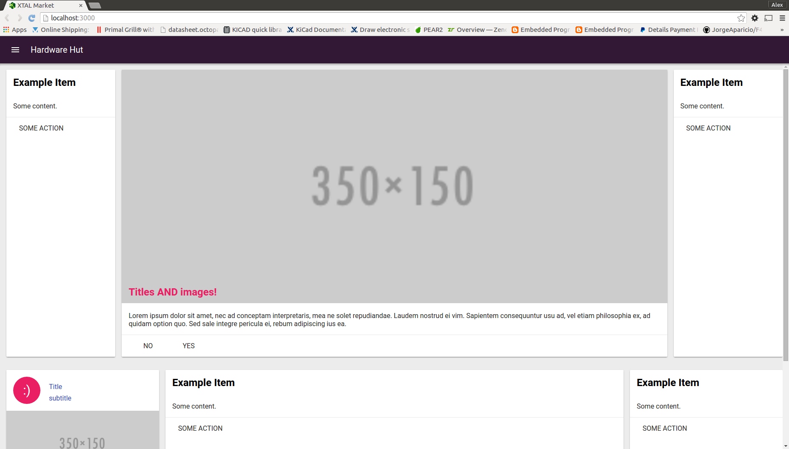

# Xtal Commerce - Node.js eCommerce

An eCommerce platform based on [LoopBack](http://loopback.io), and the ZRECore data model templates.

Requires the Strongloop loopback cli tool. Xtal Commerce development is done in ES6 (io.js)

- Strongloop Loopback cli tool
- Ruby SASS gem
- Node.js v4.0.0 or higher
- Gulp npm package
- Bower
- Browser Sync
- jshint

To setup, run this from the base directory after installing all requirements:

```
npm install
bower install
gulp
gulp serve
```

Your local instance should now be available at:

```
# Application Front-end
http://localhost:3001
```
